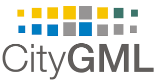

## IBPSA Project 1 
### BIM/GIS and Modelica Framework for building and community energy system design and operation
<!----->

IBPSA Project 1 will create open-source software that builds the basis of next generation computing tools for the design and operation of building and district energy and control systems. It extends work conducted under the IEA EBC Annex 60. All work is open-source and built on three standards: 
_IFC_ for data modeling at the building scale, 
_CityGML_ for data modeling at the district scale, and 
_Modelica_ for modeling the performance of building and district energy systems.

More information can be found under:
[IBPSA Project 1](https://ibpsa.github.io/project1/)

## City Geographical Markup Language (CityGML)

The City Geography Markup Language (CityGML) is a concept for the modelling and exchange of 3D city and landscape models that is quickly being adopted on an international level. 
_CityGML_ is a common information model for the representation of 3D urban objects. 
It defines the classes and relations for the most relevant topographic objects in cities and regional models with respect to their geometrical, topological, semantical and appearance properties.

More information can be found under:
[CityGML](http://www.citygmlwiki.org/index.php?title=Citygml_Wiki)

## CityGML Energy Application Domain Extension (ADE)
<!----->
 

Energy ADE is meant to offer a unique and standard-based data model to allow for both detailed single-building energy simulation (based on sophisticated models for building physics and occupants behaviour) and city-wide, bottom-up energy assessments, with particular focus on the buildings sector. 
Typical areas of application cover – but are not limited to – analyses at building and urban scale, such as energy demand diagnostics, solar potential study, simulation of low-carbon energy strategies, etc

More information can be found under:
[EnergyADE](http://www.citygmlwiki.org/index.php/CityGML_Energy_ADE)